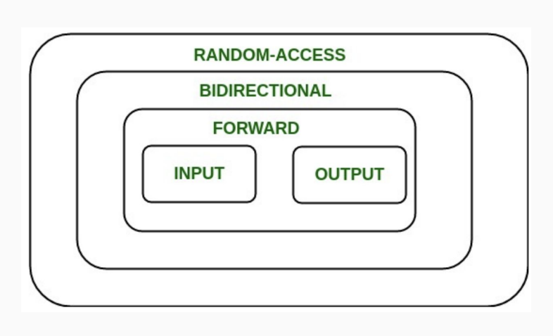

# C++

## 命名空间

相当于导入某个模块
例如：

```cpp
#include <iostream>
using namespace std;
```

就可以直接使用 `cout` 而不需要 `std::cout`
std 是标准模板库（STL）的命名空间
也可以指定某个函数或变量，如：

```cpp
using std::cout;
```

后续就可直接使用 cout.

--------------------------------------------------

## 变量和常量

c++ 是**静态**类型语言

### 基本类型

增加了**字符串**类型

```cpp
std::string name = "Preisthe";
```

### 结构体

与 C语言中的类似

#### pair

c++ 中的特殊**结构体**，位于 std 命名空间中
pair 是一个**模板**，在声明时要指定两个成员的类型
使用时用 first 和 second 访问两个域

```cpp
std::pair<int, std::string> p1(1, "hello");
cout << p1.first << " " << p1.second;
// prints "1 hello"
```

- 使用 std::make_pair 快速创建 pair 对象
  - 可用于打包返回值
  - 无需声明类型

### auto

auto 关键字，用于**编译时**自动推导类型，可以省去写复杂类型声明的麻烦
常用于

- 函数返回值类型
- 接受 make_pair 返回的 pair 对象
- 循环变量

有点像 python 了
但不要过度使用，仅在类型名过长的时候使用

### 结构化绑定

使用方括号 `[]`
例：

```cpp
auto p = std::make_pair(“s”, 5);
auto [a, b] = p;
// a is string, b is int
// auto [a, b] = std::make_pair(...);
```

就是**解包**，也适用于结构体，很像 python，但*不能嵌套*

用于循环：

```cpp
void shift(vector<std::pair<int, int>>& nums) {
    for (auto& [num1, num2]: nums) {
        num1++;
        num2++;
    }
}
```

直接**迭代**序列中的元素，很像 python 的 `for item in seq`
且上例中的变量都是**引用**（ python 貌似做不到 ）

### 变量初始化

- 统一初始化：使用花括号 `{}`
  - 结构体：`Student s = {"Sarah", "CA", 21};`
  - 向量：`std::vector<int> v{1, 2, 3};`
  - 基本类型：`int x{5};`
  - *注意区分初始化的花括号和 make_pair 的圆括号*
- std::initializer_list
  - `std::vector<int> vec(3, 5); // 3 个 5`

### 左值和右值

- 左值：**可以**出现在 = 左或右
- 右值：**只能**出现在 = 右

- l-values **有**名称，**不是**临时的
- r-values **没有**名称，**是**临时的，如常量

### 引用

***!!! 特别注意！谨慎使用对函数内局部变量的引用！超出生命域可能导致段错误！***

使用 `&` 符号，相当于对变量**取别名**，常用于函数传参，相当于直接自动指针了。例：

```cpp
void changeX(int& x){ // changes to x will persist
    x = 0;
}
```

- `&` 参与构建了一种新的变量类型，将当前变量与被引用变量**绑定**，可以对任何类型使用，用法类似创建指针时的 `*`
- 你**不能**（非 const）引用一个*右值*, only create references to variables
- 同样的，**不能**创建对常量的变量引用
- `auto&` 会根据值**自动**确定是否 const，但也可手动指定 `const auto&`
- 函数也可以**返回**引用变量，甚至可以是**左值**

#### 常见错误

```cpp
void shift(vector<std::pair<int, int>>& nums) { // 函数声明中是引用
    for (size_t i = 0; i < nums.size(); ++i) {
        auto [num1, num2] = nums[i]; // 但解包出来的变量不是引用
        num1++;
        num2++;
    }
}
```

- "=" 仅产生**值**传递，只有加上 `&` 才是引用
- 使用 auto& 避免

#### 引用的使用场景

- 当要直接**修改**传入的变量时
- 当要使用的对象**很大**时，使用引用可以避免拷贝
- 当要给变量起**别名**时

### 常量与常量引用

常量规定了一个值**不能被修改**的变量

常量也可以是**引用**，但：

- 若引用变量，则**不能**通过引用修改，相当于一个观察者
- 若引用常量，则都**不能**修改
- 常量引用可以通过 `&` 引用**右值**

## 流

How can we convert between string-represented data and
the real thing?

### 流的分类

流是对输入输出的**抽象**，在数据和字符串之间相互转化

#### 以方向分类

- 输入流：读取数据
- 输出流：写入数据
- 输入输出流：可读可写

#### 以数据源或目的分类

- console streams: 从控制台读写
- file streams: 从文件读写
- string streams: 从字符串读、向字符串写

### 流操作符

- `>>` : extraction operator
- `<<` : insertion operator

### Output Streams

- 类型：`std::ostream`
- 用 `<<` 操作符向流中输送转化成字符串后的数据
- 如：`std::cout`，是 `<iostream>` 中的一个全局常量

### Output File Streams

- 类型：`std::ofstream`
- 用 `<<` 操作符向文件流中输送转化成字符串后的数据
- 必须手动创建文件流对象，如：`std::ofstream out("file.txt");`
- ofstream 采用先清空再写入的策略，相当于 shell 重定向运算符 `>`

### Input Streams

- 类型：`std::istream`
- 用 `>>` 操作符从流中接受字符串，并转化为数据
- 如：`std::cin`，是 `<iostream>` 中的一个全局常量

Nitty Gritty（基本事实）Details of `std::cin`:

1. 第一个 `cin` 会等待用户输入
2. 每个 `>>` 读到空白字符为止（tab, space, newline）
3. 第一个空白字符之后的字符储存到 buffer，用于下一次 `>>`
4. 如果 buffer 空了，则再次等待用户输入
5. whitespace 被吃掉了

#### istream 的异常处理

当无法读取到期望的数据时，程序不会挂掉，而是读入一个默认异常值，如 int 的 0，str 的空字符串

而后，输入流的 fail 位被设为 1，因此不能再接受输入

### std::getline()

函数声明：

```cpp
istream& getline(istream& is, string& str, char delim);
```

- `is` 是输入流，如 `std::cin`
- `str` 是要储入的字符串
- `delim` 是分隔符，默认是换行符

**How it works**:

1. 清空 str 中的内容
2. 提取 is 中的内容，直到：
   - EOF，并设高 EOF 位（`is.eof()`）
   - 碰到 delim（不包括 delim 本身）
   - str 没有空间了，并设高 fail 位（`is.fail()`）
3. 如果出于某种原因没读到任何字符，则 fail

**不要混用 `>>` 和 `getline` !**
因为 `>>` 会保留空白字符，而 `getline` 会越过 delimiter

### Input File Streams

- 类型：`std::ifstream`
- 用 `>>` 操作符从文件流中接受字符串，并转化为数据
- 必须手动创建文件流对象，如：`std::ifstream in("file.txt");`
- 文件流 ifstream 和 ofstream 位于 `<fstream>` 中

### String Streams

作用：把**字符串**当作**流**来处理
字符串流位于 `<sstream>` 中

有

- `std::istringstream`：只读
- `std::ostringstream`：只写
- `std::stringstream`：可读可写

三类

- 其中的读写是指**字符串流**的读和写的动作
- 用圆括号初始化字符串流，如：

```cpp
std::string str = "Hello, World!";
std::stringstream ss(str);
```

--------------------------------------------------

## 函数

### 函数重载

函数名相同，参数不同（参数类型不同或参数个数不同），增加了函数名使用的方便性
例：

```cpp
int half(int x, int divisor = 2) { // (1)
return x / divisor;
}
double half(double x) { // (2)
return x / 2;
}
half(4)// uses version (1), returns 2
half(3, 3)// uses version (1), returns 1
half(3.0) // uses version (2), returns 1.5
```

同时，*c++ 引入了函数默认参数*

## 容器

容器是一种用于组织数据的数据结构类型

vector, deque, list, map, set 等都是容器

### std::vector

动态数组

#### 基本操作

- `v.size()` 返回大小
- `v.push_back(x)` 在末尾添加元素
- `v[i] = k` 访问元素
- `v.empty()` 判断是否为空
- `v.clear()` 清空

## 迭代器

迭代器是一种用于遍历容器中元素的对象，有头有尾，可以前后移动，可以比较，跟指针简直一毛一样

其实迭代器是“广义”指针，C 语言中的指针只是迭代器的一种

stl 中的所有容器都支持迭代器，但并不完全相同

一些共同属性：

- Initializing: `iter = s.begin()`
- Incrementing: `++iter`
- Dereferencing: `*iter`
- Comparing: `iter != s.end()`
- Copying: `new_iter = iter`

迭代器层次关系图：



- `input` 只能读取值，`output` 在此基础上还能写入值
- `bidirectional` 可以向前向后移动
- “随机”访问意味着访问任何位置的元素所需的时间都是一样的，类似索引
- 指针就是 Random-access 类迭代器
- stl 容器至少支持 forward 迭代器

stl 迭代器：


