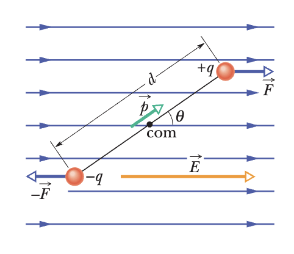

## lecture 01: Coulomb's Law and the Electric Field

### 电荷

电荷是量子化的，元电荷 $e=1.602\times 10^{-19}C$.  
$C$: 库仑，电荷单位  
电子质量：$9.109\times 10^{-31}kg$

电荷守恒定律：电荷不能凭空产生或消失  
电荷在洛伦兹变换下保持不变，即没有相对论效应  
密立根油滴实验测量了元电荷

### 库仑定律

描述了两个点电荷之间的相互作用力，与距离的平方成反比，与电荷的乘积成正比  
标量形式：$F=k\frac{q_1q_2}{r^2}$  
向量形式：$\vec{F}=k\frac{q_1q_2}{r^2}\hat{r}$  
其中 $k=\frac{1}{4\pi\epsilon_0}$，$\epsilon_0=8.85\times 10^{-12}F/m$ 是真空介电常数

### 电场

电场是**向量场**， $\vec{E}(x, y, z)$  
定义某点的电场强度为**试探电荷**在该点受到的力与电荷的比值
$$
\vec{E}=\vec{F}/q_0
$$
则根据库仑定律，点电荷产生的电场为
$$
\vec{E}=\frac{kq}{r^2}\hat{r}
$$

#### 电场线

是一种假想的，用来表示电场分布的线，电场线从正电荷出发，指向负电荷，密集处电场强，稀疏处电场弱

### 电偶极子

两个等量异号的点电荷组成的系统  
用**电偶极矩**描述电偶极子的特性：
$$
\vec{p}=q\vec{d}
$$
其中 $\vec{d}$ 代表两个电荷之间的距离向量，从负电荷指向正电荷

#### 电偶极子产生的电场

电荷连线轴上（标量形式）：
$$
E=\frac{q}{4\pi\epsilon_0(z-\frac{1}{2}d)^2} - \frac{q}{4\pi\epsilon_0(z+\frac{1}{2}d)^2}
$$
对于 $z\gg d$，可以近似为
$$
E=\frac{1}{2\pi\epsilon_0}\frac{p}{z^3}
$$

#### 电偶极子受到的力矩

由于电荷等量异号，电偶极子受到的合力为 0，但力矩不为 0

$$
\vec{\tau}=\vec{p}\times\vec{E}
$$
倾向于将电偶极子转到与电场方向一致
