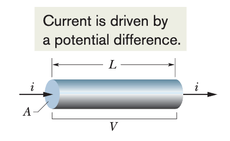
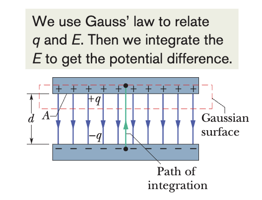
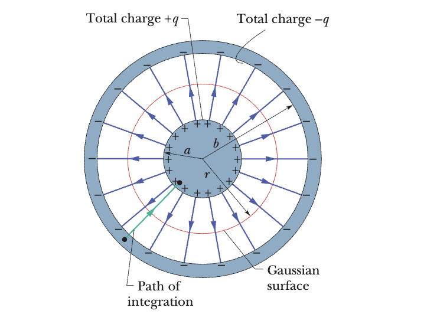

## lecture 06: Resistance and Capacitance

### 电流

**定义为单位时间内通过某一截面的电荷量**
$$
I=\frac{dq}{dt}
$$
同一条导线上电流处处相等，这是因为电荷守恒。

**别看他这么定义，安培(A)才是国际单位制的基本单位（虽然电流定义好像改了）*

**电流是标量**

- 我们所说的**电流方向**只是指示电荷运动的方向，但电流代表的是一种**强度**
- 电流的方向规定为正电荷移动的方向

### 电流密度

描述了一块曲面上电流的分布情况
$$
i=\int\vec{J}\cdot d\vec{A}
$$
因为曲面元有方向，所以电流密度也有了方向

### 漂移速度

电子原先在导体中作无规则运动，净速度为 0. 当施加外电场产生恒定电流时，他们仍然继续作无规则运动，但在此基础上叠加了一个跟随电场漂移的速度。相比于无规则运动，漂移速度要小得多

对于图中的导线，自由运动的总电荷为
$$
q=(nAL)e
$$
电流
$$
i=\frac{q}{\Delta t}=nAev_d,\quad or\quad \vec{J=ne\vec{v}_d}
$$
要估算 $v_d$，首先要了解电阻

### 电阻

$$
\begin{align}
  R&=V/i\\\\
  &=\rho L/A
\end{align}
$$
其中 $\rho$ 是**电阻率**，$L$ 是导线的长度，$A$ 是截面积。电阻的单位是欧姆（$\Omega$）.

- 电阻率与电导率互为倒数，$\rho=1/\sigma=E/J$，这个式子将电阻率、电导率、电场强度和电流密度联系了起来。
- 电阻是一个物体的属性，而电阻率仅是一种材料的属性

### 回到漂移速度

考虑金属材料中的自由电子模型，电子有平均自由时间 $\tau$ (mean free time) 和平均自由程，在这段时间内电子可以不受约束在电场力作用下加速。之后电子与原子核碰撞，恢复无规则运动，重新开始加速。

应用经典力学推导：
$$
\begin{align}
  \vec{a}&=\frac{\vec{F}}{m}=-\frac{e\vec{E}}{m}\\\\
  \vec{v}_d&=\vec{a}\tau=-\frac{e\vec{E}}{m}\tau
\end{align}
$$
再结合 $\vec{J}$ 与 $v_d$，$\vec{J}$ 与 $\vec{E}$ 的关系
$$
\begin{cases}
  \vec{J}=n(-e)\vec{v}_d\\\\
  \vec{E}=\rho\vec{J}\\\\
  \vec{v}_d=-\frac{e\vec{E}}{m}\tau
\end{cases}
$$
得到
$$
\rho=\frac{m}{ne^2\tau}
$$
对于通常情况下的金属，$n$ 和 $\tau$ 都可以看作常数，因此**欧姆定律**成立。这样，利用欧姆定律测出电阻率，进而可以估计出 $\tau$ 和 $v_d$.

利用热学知识，可以估算出电子在室温下无规则运动的平均速度
$$
\frac{1}{2}mv_{th}^2=\frac{3}{2}k_B T
$$

将两者进行比较，我们发现电子的漂移速度确实非常小。

### 连续性方程

在上面的推导中，我们其实已经默认了（局部的）电荷守恒定律。也就是说，如果一块区域中的总电荷量发生了改变，那么一定有等量的电荷通过区域的边界曲面，流入或流出这块区域。
$$
\frac{\partial\rho}{\partial t}=-\nabla\cdot\vec{J}
$$

### 电容

**电容器**是存储电荷的器件。**电容**表示了电容器存储电荷的能力
$$
C=\frac{q}{V}
$$

#### 平行板电容器

忽视边缘效应，可以把平行板之间的电场看作匀强电场

利用高斯定理，$q=\epsilon_0EA$
$$
C=\frac{q}{V}=\frac{q}{Ed}=\frac{\epsilon_0A}{d}
$$

#### 柱形电容器

假设圆柱长度 L 远大于半径，忽视边缘效应

取不同半径的圆柱面作为高斯面，可以得到柱形电容器内的电场分布
$$
\begin{align}
  q&=\epsilon_0E(2\pi rL)\\\\
  V&=\int_a^bEdr=\frac{q}{2\pi\epsilon_0L}\int_a^b\frac{dr}{r}\\\\
  C&=\frac{q}{V}=2\pi\epsilon_0\frac{L}{\ln(b/a)}
\end{align}
$$
