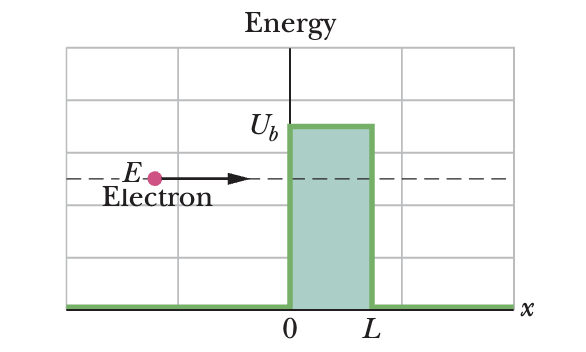
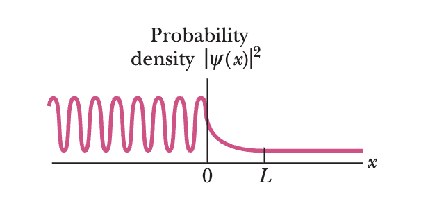

## lecture 23: Schroedinger’s Equation

### 薛定谔方程

那么我们如何描述波函数呢？
$$
\psi(x, t)=e^{i(kx-\omega t)}
$$
从这个形式出发。

首先，粒子的能量可以表示为
$$
E=\frac{p^2}{2m}
$$
根据德布罗意的假设，我们可以得到
$$
\begin{align}
    p=\frac{h}{\lambda}=\hbar k=-i\hbar\frac{1}{\psi(x,t)}\frac{\partial\psi(x,t)}{\partial x}\\\\
    p^2=\hbar^2k^2=-\hbar^2\frac{1}{\psi(x,t)}\frac{\partial^2\psi(x,t)}{\partial x^2}
\end{align}
$$
类似地，
$$
E=\hbar\omega=i\hbar\frac{1}{\psi(x,t)}\frac{\partial\psi(x,t)}{\partial t}
$$
于是，在波函数表示下，能量与动量的关系为
$$
i\hbar\frac{1}{\psi(x,t)}\frac{\partial\psi(x,t)}{\partial t}=-\frac{\hbar^2}{2m}\frac{1}{\psi(x,t)}\frac{\partial^2\psi(x,t)}{\partial x^2}
$$
但还需要加上势能项，即
$$
E=\frac{p^2}{2m}+U(x)
$$
在这里 E 是常数，但 p 却不一定是常数，也就是说，平面波不再是薛定谔方程的解（p 对应 k，即频率会变化）。

最终的一维薛定谔方程为
$$
i\hbar\frac{\partial\psi(x,t)}{\partial t}=-\frac{\hbar^2}{2m}\frac{\partial^2\psi(x,t)}{\partial x^2}+U(x)\psi(x,t)
$$

### 波函数的解

大部分情况下，$U(x)$ 都与 $t$ 无关，我们可以将波函数写为
$$
\psi(x,t)=\phi(x)e^{-iEt/\hbar}
$$
代入方程：
$$
\left[-\frac{\hbar^2}{2m}\frac{\partial^2}{\partial x^2}+U(x)\right]\phi(x)=E\phi(x)
$$
在自由空间中，即 $U(x)=0$，通解为
$$
\phi(x)=Ae^{ikx}+Be^{-ikx},\quad k=\sqrt{2mE/}\hbar
$$
这两项分别代表了波函数的左行波和右行波。

再乘上时间项就变成：
$$
\psi(x,t)=Ae^{i(kx-\omega t)}+Be^{-i(kx+\omega t)},\quad\omega=E/\hbar
$$

### 波包

量子的速度是多少呢？

如果考虑波前的速度，即相速度，则
$$
v_{ph}=\frac{\omega}{k}=\sqrt{\frac{E}{2m}}
$$

这与经典力学中的速度 $v_{cl}=\sqrt{\frac{2E}{m}}$ 不同。

事实上，一个粒子的状态是由多个静止自由粒子（平面波）的线性叠加来描述的

$$
\Psi(x,t)=\frac{1}{\sqrt{2\pi}}\int_{-\infty}^{\infty}\phi(k)e^{i\left(kx-\frac{\hbar k^2}{2m}t\right)}dk
$$

由于概率在整个空间上的积分为 1，所以 $\phi(k)$ 必须满足一定条件。

当越来越多的平面波叠加时，波包的形状会逐渐变得尖锐，即粒子的位置逐渐确定，此时 $\Delta p$ 也不断增大，符合海森堡不确定性原理。

而且波包的群速度 $v_{group}=\frac{d\omega}{dk}$，正好就是粒子的速度

### 势能阶跃

假设一束电子穿过 $x=0$ 处的一个势能阶跃，高度为 $V_b<0$，每个电子的能量为 $E$

#### 反射系数

**假设$E>qV_b$**，则根据经典力学，电子应该都会穿过阶跃。

在量子力学，我们在两个区域分别应用薛定谔方程，利用 $x=0$ 处的**值与斜率相等**的边界条件求解

由于区域 2 中没有电子向左运动，所以 $D=0$
$$
\begin{align}
    A+B&=C\\\\
    Ak-Bk&=Ck_b
\end{align}
$$
我们可以求出电子反射的概率，定义反射系数 $R$ 如下：
$$
R=\frac{|B|^2}{|A|^2}=\left|\frac{k-k_b}{k+k_b}\right|^2
$$
这说明，根据量子力学理论，电子不会完全通过阶跃，而是会反射一部分。

#### 透射系数

然后我们用 $1$ 减去 $R$ 来求透射系数（注意 $k$ 和 $k_b$ 都是复数）：
$$
\begin{align}
    T=1-R&=\frac{\left|k+k_b\right|^2-\left|k-k_b\right|^2}{\left|k+k_b\right|^2}\\\\
    &=\frac{4\Re(kk_b^*)}{\left|k+k_b\right|^2}
\end{align}
$$
当 $E>qV_b$ 时，$k$ 和 $k_b$ 都是实数，所以 $T$ 和 $R$ 都不为 0 ，且 $T+R=1$.
当 $E<qV_b$ 时，$k$ 仍是实数，但 $k_b$ 是虚数，所以 $T=0$，$R=1$，电子全部反射。

#### 流密度

注意到当 $E>qV_b$ 时，
$$
\frac{\left|C\right|^2}{\left|A\right|^2}=\frac{4k^2}{\left|k+k_b\right|^2}=T\frac{k}{k_b}
$$
这里我们考虑**电流密度** $J=nqv$：
$$
T=\frac{\left|C\right|^2k_b}{\left|A\right|^2k}
   =\frac{\left|C\right|^2q\left(\hbar k_b/m\right)}{\left|A\right|^2q\left(\hbar k/m\right)}
=\frac{J_{\text{transmitted}}}{J_{\text{incident}}}
$$
同理，
$$
R=\frac{\left|B\right|^2k}{\left|A\right|^2k}=\frac{J_{\text{reflected}}}{J_{\text{incident}}}
$$
电流守恒：
$$
J_{\text{transmitted}}+J_{\text{reflected}}=J_{\text{incident}}
$$

### 势垒

势垒是一段宽度为 $L$，势高为 $V_0$ 的区域，我们仅考虑 $E<qV_b$ 的情况

事实上，通过计算我们发现，电子出现在势垒另一侧的概率并不为 0.

注意上图展现的是**振幅的平方**，即概率。  
驻波 + 指数衰减 + 恒定的透射流
$$
    T\approx e^{-2\kappa L}
$$
其中
$$
    \kappa=\frac{\sqrt{2m(qV_b-E)}}{\hbar}
$$
这就是**量子隧穿**效应
