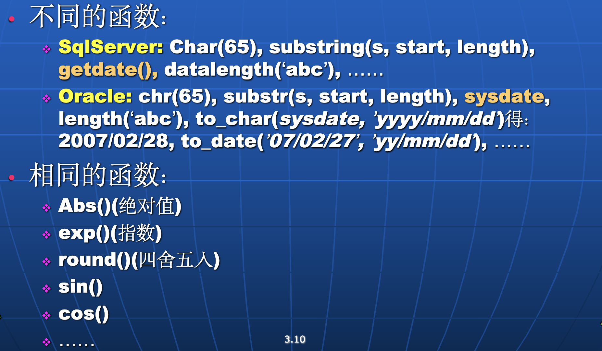

# SQL

## Data Definition

#### Create Table

```sql
CREATE TABLE instructor (
    ID char(5), // char(5) 表示 5 个字符
    name varchar(20) not null,
	dept_name varchar(20), // 变长字符串，最大长度 20
	salary numeric(8,2), // 8位，2位小数
	primary key (ID),
    check (salary >= 0)
);
```
***属性名不能包含 '-' ，用下划线替代***

指定属性名、属性类型、限制条件等，还可指定主键、外键等

- super-key
- candidate key
- primary key

#### Other Domain Types

- real // 浮点数
- data // 2025-3-4
- time // 11:27:00
- Timestamp // data + time

此外 sql 还包含一系列类型转换函数


#### 删除
```sql
DROP TABLE instructor;
```

#### 增删属性
```sql
alter table instructor add birthday date; // 默认为 null
alter table instructor drop column birthday; // 可能不支持
ALTER TABLE instructor MODIFY (ID char(10), salary not null); // 修改属性类型
```
#### 创建索引
```sql
CREATE INDEX <i-name> ON <table-name>  (<attribute-list>);
// 可以给一个或多个属性创建索引，提高查询速度
create unique index ID on instructor(ID);
// 创建唯一索引
```

- DROP INDEX 删除

## Data Manipulation

### SELECT
```sql
SELECT <attribute-list> FROM <relation-list> WHERE <condition>;
```
起到 $\Pi_{a1, a2..}(\sigma_P(R1 \times R2 \times ...))$ 的作用，select 的返回结果也是一个 relation

- names 不区分大小写

#### 其他用法

- (DISTINCT|ALL) // 去重，默认为 ALL
- 当有多个 attribute 时，整个元祖相同才算重复
- '*' 表示所有属性
- attribute-list 可以包含表达式，如+-*/
    - 还可以包含函数等操作，对结果进行处理，如
        - 字符串拼接：select 'attr=' || a1 from ...
        - upper(), lower()
        - strlen, substr 等功能
    - Aggregate Function
        - count, sum, avg, max, min
        - Agg Fun 之外的属性**必须出现在** group by 中
        - 如果要对 Agg Fun 的结果进行筛选，需要用 having
- order by 排序，默认升序，降序用 name desc

#### WHERE

- 可用逻辑运算符：AND, OR, NOT, BETWEEN..AND
- 实现自然链接：WHERE R1.ID = R2.ID
- LIKE 实现模糊匹配
  - % 匹配任意字符串
  - _ 匹配任意字符

#### 别名

- 可用 AS 关键字，AS 可以省略：SELECT name AS instructor_name FROM instructor;
- 某些：new_name = column
- 可以给 column 和 relation 起别名
- 可以使引用更简洁
- 表内相互比较时，用于区分

#### Set Operation

默认**去重**，后加 ALL 可以不去重

- UNION     // 并集
- INTERSECT // 交集
- EXCEPT    // 差集

#### Summary

```sql
SELECT <[DISTINCT] c1,c2,…> FROM <r1,…>
[WHERE <condition>]
[GROUP BY <c1,c2,…> [HAVING <cond2>] ]
ORDER BY <c1[DESC][,c2[DESC|ASC],…]>
```

- GROUP BY子句应该在HAVING子句之前
- 执行顺序：From → where → group (aggregate) → having → select → order by  
  **因此 where 后的条件先于 having 后的条件进行筛选**
- 当出现嵌套时，在同一SQL语句内，除非外层查询的元组变量引入内层查询，否则内层查询只进行一次。

#### Null

- 任何涉及 null 的算术表达式都为 null
- 在 where 中，null 为 false
- 比较运算符：IS NULL, IS NOT NULL
- Aggregate Function，除了 count(*)，通常忽略 null

#### 全称量词和存在量词

```sql
C <comp> ALL/SOME r
// <comp> 为比较运算符
```

#### exists


EXISTS 针对 relation，而 NULL 针对属性的值

#### unique

用于判断 relation 中是否存在重复元组

### VIEW

视图的目的：简化复杂查询，提高重用性，隐藏底层实现细节

```sql
CREATE VIEW <view-name> AS <query>;
CREATE VIEW <view-name> (<attr1>, <attr2>, ...) AS <query>; // 重命名
```

还可以创建临时视图，如

```sql
select dept_name, avg_salary
---
from (select dept_name, avg (salary)
          from instructor
          group by dept_name)
          as dept_avg (dept_name, avg_salary) -- 临时视图
---
where avg_salary > 42000;
```

#### WITH

WITH 可以创建局部视图，仅用于当前 query

```sql
WITH <view-name> AS <query>
SELECT <attr> FROM <view-name>;
```

### DELETE

```sql
DELETE FROM <table|view> [WHERE <condition>] -- 删除满足条件的元组
```
标准SQL不允许在单个DELETE语句中同时删除多个表的数据（MySQL部分支持但需要特殊语法）

### INSERT

```sql
INSERT INTO <table|view> [(c1,c2,…)] VALUES (e1,e2,…); -- 缺省为 null
INSERT INTO <table|view> [(c1,c2,…)] select e1,e2,… from …;
```

The `select from where` statement is fully evaluated before any of its results are inserted into the relation. So the statement below is right:

```sql
insert into table1 select * from table1;
```

### UPDATE

```sql
UPDATE <table | view>
    SET <c1=e1 [,c2=e2,… ]>
[WHERE <condition>];
```

#### CASE

```sql
update instructor
set salary = case
                when salary <= 10000
                then salary *1.05
                else salary *1.03 
            end;
```

#### Update of a View

- View 是虚表，对其进行的所有操作都转化为对基表的操作。
- Most SQL implementations allow updates only on simple views defined on a single relation and without aggregates.

### Transaction

事务是一系列数据库操作序列，这些操作要么**全部完成**，要么**全部不完成**，是一个不可分割的工作单位。

- commit
- rollback

### Join

#### 语法

- **自然连接**：R natural {inner join, left join, right join, full join} S
- **非自然连接**：R {inner join, left join, right join, full join} S
    on <连接条件判别式>
    using (<同名的等值连接属性名>)

#### tip

- 由于不会引起歧义，`inner`、`outer` 可省略。
- 但 `natural` 不能省略，不然就变成笛卡尔积了。
- 非自然连接，容许不同名属性的比较；且结果关系中不消去重名属性
- 使用 using 的连接类似于 natural 连接。但仅以 using 列出的公共属性为连接条件。

## Intermidiate

### Integrity Constraints

对数据库中数据的某种限制，比如

#### Single Relation

- primary key
- not null
- unique

**CHECK**语句可以限定某个属性必须满足某个条件，在 create table 时使用。

```sql
create domain hourly-wage numeric(5,2)
    constraint value-test check(value > = 4.00);
```

给 constraint 命名可以用于 debug。

#### Referential Integrity

**foreign key**，需进行以下检查：

- Insert 确保新插入的元组在参照关系中存在
- Delete 要么 reject，要么 cascading delete

**SQL 中的写法**：

```sql
foreign key (dept_name) references department -- 在最后指定
dept_name  varchar (20) references department -- 在定义时指定
```

**foreign key** 默认引用主键，也可以指定引用其他属性，但必须是唯一的

```sql
foreign key (dept_name) references department (building)
```

**冲突处理方法**

```sql
create table course( 
            . . .
    foreign key(dept_name) references department
            [on delete cascade]
            [on update cascade]
            . . . );
```

- NULL 是视作符合外键要求的值

#### Assertions

```sql
CREATE ASSERTION <assertion-name>
    CHECK <predicate>;
```

每当系统更新时都运行检查，开销很大

#### Trigger

**Example**

```sql
create trigger timeslot_check1 after insert [of <attr>] on section
            referencing new row as nrow
            for each row
            when (nrow.time_slot_id not in (
                        select time_slot_id
                         from time_slot)) /* time_slot_id not present                
                                                         in time_slot */
             begin
                rollback
             end;
```

或者直接检查整个表：

```sql
referencing new table as ntable
for each statement
    ...
```

删除触发器：drop trigger <触发器名>;

### Authorization
